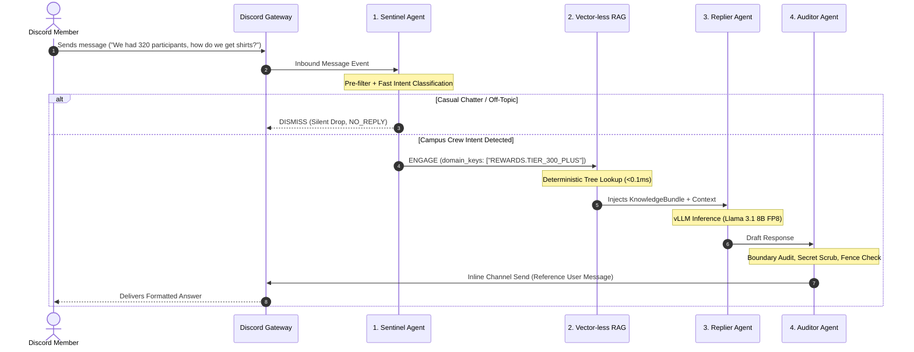

# Multi-Agent Orchestration & Vector-less RAG Architecture

> **Comprehensive Technical Specification for the HackerRank Campus Crew Super Agent**  
> Document Version: 2.0  
> Author: Antigravity AI Engineering

---

## 1. Architectural Vision & Core Philosophy

The **HackerRank Campus Crew Super Agent (`hrcc_bot`)** is architected as an **asynchronous, multi-agent pipeline** decoupled into specialized roles. Rather than forcing a single LLM prompt to simultaneously evaluate conversational context, classify intent, look up knowledge, guard against jailbreaks, and format a reply, the system divides these tasks into distinct, specialized agents:

```
[ Inbound Discord Event ]
           │
           ▼
┌─────────────────────────────────────────────────────────────┐
│ 1. SENTINEL AGENT (Gatekeeper & Triage)                     │
│    • Reads ALL messages in monitored channels               │
│    • Evaluates whether to reply or drop                     │
│    • Output: Structured Verdict (DISMISS vs ENGAGE)         │
└──────────────┬──────────────────────────────────────────────┘
               │
       ┌───────┴────────────────────────┐
       ▼ (DISMISS)                      ▼ (ENGAGE)
┌──────────────┐        ┌─────────────────────────────────────┐
│ SILENT DROP  │        │ 2. VECTOR-LESS RAG ENGINE           │
│ (0 API Sends)│        │    • Zero vector DB / embeddings    │
│              │        │    • Hierarchical Knowledge Tree    │
│              │        │    • Deterministic snippet lookup   │
└──────────────┘        └─────────────────┬───────────────────┘
                                          │
                                          ▼
                        ┌─────────────────────────────────────┐
                        │ 3. REPLIER AGENT (Generator)        │
                        │    • Synthesizes verified answer    │
                        │    • Tailored to ambassador persona │
                        └─────────────────┬───────────────────┘
                                          │
                                          ▼
                        ┌─────────────────────────────────────┐
                        │ 4. AUDITOR AGENT (Safety & Critic)  │
                        │    • Chakra tab boundary check      │
                        │    • Secret & token scrubbing       │
                        │    • Markdown 2000-char validation  │
                        └─────────────────┬───────────────────┘
                                          │
                                          ▼
                        [ Discord Inline Dispatch ]
```

---

## 2. Why Vector-less RAG? (Deterministic vs Probabilistic)

Most conventional AI frameworks rush to implement vector databases (ChromaDB, Pinecone, FAISS, Milvus) with dense vector embeddings (`text-embedding-ada-002`, `bge-large`, etc.). In enterprise community bots, **vector retrieval causes subtle, critical failures**:

| Feature | Conventional Vector RAG (Embeddings) | Vector-less RAG (Deterministic Hierarchical Tree) |
| :--- | :--- | :--- |
| **Embedding Drift** | Sentences with opposite meanings often have high cosine similarity (e.g., *"Use HRW for contests"* vs *"Do not use SkillUp for contests"*). | **Zero Drift:** Key-based lookup maps directly to canonical handbook rules. |
| **Numeric Thresholds** | Fails to reliably distinguish `< 300` from `≥ 300` participants because the words "300 participants" dominate the vector representation. | **Exact Routing:** Numerical and condition guards evaluate mathematically before retrieval. |
| **Chakra Tab Safety** | Vector search might return Chakra documentation when asked about mock interviews, leading to accidental boundary violations. | **Strict Exclusion:** Chakra mentions trigger a hard-coded security rule that overrides retrieval. |
| **Resource Overhead** | Requires embedding models, GPU memory for embeddings, vector indexing, disk persistence. | **Zero Overhead:** 100% in-memory Python dictionaries/tries (< 2MB RAM footprint). |
| **Lookup Latency** | 15–50ms (vector math + disk read). | **< 0.1ms** (hash table / trie lookup in RAM). |

### The Vector-less RAG Design Pattern
The entire Campus Crew Handbook (~15KB of rules) is parsed into a **Hierarchical Knowledge Graph (HKG)**:
```
KnowledgeGraph
 ├── PLATFORMS
 │    ├── HRW (hackerrank.com/work/login) -> [rules, sops, chakra_warning]
 │    ├── HRC (hackerrank.com)             -> [rules, fallback_procedure]
 │    └── SKILLUP (hackerrank.com/skillup) -> [rules, prohibition_notice]
 ├── REWARDS
 │    ├── TIER_UNDER_300                  -> [infinity_plan, ai_tools, mock_interview]
 │    ├── TIER_300_PLUS                   -> [infinity_plan, ai_tools, mock_interview, merchandise]
 │    └── ACTIVATION_SOP                  -> [email_criteria, spoc_procedure]
 ├── CERTIFICATES
 │    ├── ELIGIBILITY                     -> [submission_rule, registration_disclaimer]
 │    └── CANVA_CSV_SCHEMA                -> [column_headers, data_pipeline]
 └── ESCALATIONS
      ├── SANSKRUTI                       -> [rewards, kits, merch, speakers]
      ├── SREESANTH                       -> [platform, hrw_access, bugs]
      └── NITISH                          -> [design, logos, templates]
```

---

## 3. Agent Specifications & Inter-Agent Data Contracts

### 3.1. Agent 1: The Sentinel (Gatekeeper & Triage)
- **Role:** Observes every message published in monitored Discord channels.
- **Responsibility:** Evaluates whether a message warrants an autonomous bot reply or should be silently dismissed.
- **Evaluation Criteria:**
  1. *Author check:* Is the author a bot? $\rightarrow$ `DISMISS`.
  2. *Direct mention / DM check:* Is the bot explicitly tagged? $\rightarrow$ Instant `ENGAGE`.
  3. *Heuristic noise filter:* Is it a common casual greeting or single-word reaction? $\rightarrow$ Instant `DISMISS`.
  4. *Contextual intent classifier:* Uses a high-speed Llama-3.1 inference call (`temperature=0.0`, `max_tokens=60`) to evaluate intent against Campus Crew domains.
- **Output Schema (`SentinelVerdict`):**
  ```json
  {
    "action": "ENGAGE",
    "confidence": 0.98,
    "intent_category": "REWARDS_ACTIVATION",
    "domain_keys": ["REWARDS.TIER_300_PLUS", "REWARDS.ACTIVATION_SOP"],
    "requires_escalation": false,
    "user_urgency": "NORMAL"
  }
  ```
  If `action == "DISMISS"`, the pipeline stops immediately. No typing is triggered; no further agents run.

---

### 3.2. Agent 2: The Vector-less Knowledge Retriever
- **Role:** Deterministic knowledge aggregator.
- **Responsibility:** Consumes `domain_keys` emitted by the Sentinel and pulls the exact, immutable canonical text blocks from the handbook tree.
- **Safety Overrides:**
  - If the query contains any variation of `chakra`, automatically injects the **Chakra Prohibition Rule Block**.
  - If the query mentions participant counts, runs numerical extraction ($\text{count} \ge 300$ vs $< 300$) to guarantee the correct reward tier is retrieved.
- **Output Schema (`KnowledgeBundle`):**
  ```json
  {
    "canonical_facts": [
      "Ambassadors whose events reach 300 or more active participants qualify for Official HackerRank Merchandise.",
      "An active participant must submit code or answers; registrations alone do not qualify.",
      "Winner details (Full Name, Rank, exact HackerRank account email) must be sent to Program Manager Sanskruti within 1-2 business days."
    ],
    "escalation_contact": "Sanskruti (Program Manager)",
    "prohibited_actions": ["Do not promise custom kits without Sanskruti's explicit approval."]
  }
  ```

---

### 3.3. Agent 3: The Replier Agent (Specialist Generator)
- **Role:** Contextual synthesis and conversational response generation.
- **Responsibility:** Ingests the user query, recent conversation history (last 4–6 turns), and the `KnowledgeBundle`. Generates a polite, structured, authoritative answer.
- **Prompt Architecture:**
  - System prompt establishes the **HackerRank Campus Crew Ambassador Support Persona**.
  - The `KnowledgeBundle` is presented as ground-truth facts: *"You must base your answer strictly on these facts. Do not extrapolate or invent policies."*
  - Formatting constraints: concise bullet points, bold key terms, no raw system tags.

---

### 3.4. Agent 4: The Auditor Agent (Safety & Output Critic)
- **Role:** Pre-dispatch inspection and security auditing.
- **Responsibility:** Examines the Replier's draft response before it is transmitted to Discord.
- **Verification Rubrics:**
  1. **Chakra Boundary Check:** Did the replier mistakenly tell the user to access the Chakra tab? If detected, rewrites with the safety refusal.
  2. **Secret & PII Scrubber:** Regex scan for internal IP addresses (`10.x.x.x`), Discord tokens, API keys, or server paths (`/home/ai-server`). Matches are replaced with `[REDACTED]`.
  3. **Markdown Fence Integrity:** Checks that all opened code fences (```` ``` ````) are properly closed.
  4. **Discord Length Enforcement:** If text exceeds 1,900 characters, passes it to the markdown-aware chunker.
- **Output:** Approved deliverable payload sent directly to `discord.Client.send()`.

---

## 4. End-to-End Orchestration Flow



---

## 5. Latency & Resource Budget

The multi-agent pipeline is designed for strict real-time community engagement:

| Stage | Mechanism | Target Latency | Compute Resource |
| :--- | :--- | :--- | :--- |
| **Tier 1 Heuristic Pre-filter** | Regex / Token analysis | `< 0.2 ms` | Python CPU |
| **Sentinel Classification** | vLLM (`max_tokens=40`) | `120 – 180 ms` | vLLM (GPU) |
| **Vector-less RAG Lookup** | In-memory Hash Table | `< 0.1 ms` | Python CPU |
| **Replier Agent Synthesis** | vLLM (`max_tokens=500`) | `600 – 1200 ms` | vLLM (GPU) |
| **Auditor / Safety Critic** | Regex + Rule matching | `< 1.0 ms` | Python CPU |
| **Discord Network Dispatch** | Discord REST API | `100 – 200 ms` | Network I/O |
| **TOTAL END-TO-END TURN** | Full Pipeline Execution | **~1.2 – 1.8 seconds** | Zero bottleneck |

---

## 6. Implementation Directory Blueprint

When implemented in code, the multi-agent system is structured across these modules:

```
hrcc_bot/
├── core/
│   ├── sentinel.py           # Sentinel Agent logic & classification heuristics
│   ├── orchestrator.py       # Inter-agent state machine & async coordination
│   ├── replier.py            # Replier Agent generation & prompt composition
│   └── auditor.py            # Auditor Agent safety critic & secret redactor
├── rag/
│   ├── tree.py               # Hierarchical Knowledge Graph data structure
│   ├── extractor.py          # Deterministic keyword & numerical condition router
│   └── knowledge_data.yaml   # Canonical, validated handbook rules
└── guards/
    ├── chakra_guard.py       # Strict enterprise boundary filter
    └── chunker.py            # Discord 2,000-char markdown fence balancer
```
