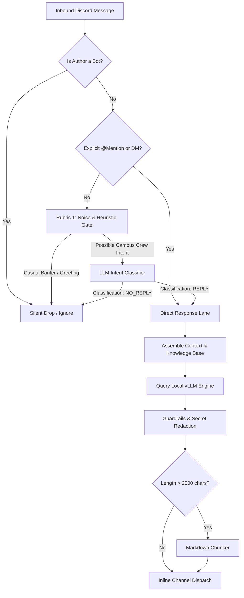

# HackerRank Campus Crew Super Agent (`hrcc_bot`)

> **Comprehensive Technical Documentation & Architecture Specification**  
> Dedicated Discord support bot for the HackerRank Campus Crew ambassador program, powered by local high-throughput vLLM (`Meta-Llama-3.1-8B-Instruct-FP8`).

---

## 📌 Table of Contents
1. [Project Overview](#project-overview)
2. [Architecture Highlights](#architecture-highlights)
3. [Documentation Index](#documentation-index)
4. [Multi-Rubric Decision Flow](#multi-rubric-decision-flow)
5. [Core Program Principles](#core-program-principles)
6. [System Directory Structure](#system-directory-structure)
7. [Operational Commands & Management](#operational-commands--management)

---

## 1. Project Overview

The **HackerRank Campus Crew Super Agent (`hrcc_bot`)** is a dedicated Discord bot designed to assist student ambassadors running campus events (contests, hackathons, workshops, and tech talks).

### Why a Dedicated Super Agent?
Previous iterations deployed via generalized multi-agent gateways (like Hermes / OpenClaw) faced recurring platform mismatches:
- Unwanted creation of Discord threads for every message (`auto_thread: true`).
- Prompting end users with maintenance prompts (`📬 No home channel is set`).
- Rejection of model silence (`_UNEXPECTED_SILENCE_REPLY`), causing the bot to reply to all casual messages with warnings.
- Resource overhead from unused toolsets (terminal, web browser, file operations, kanban dispatchers).

The `hrcc_bot` architecture eliminates these issues by utilizing a **specialized multi-rubric intent pipeline** built directly on top of `discord.py` and local **vLLM** inference on `ai-server` (`10.1.53.27`).

---

## 2. Architecture Highlights

- **Deterministic Silent Drops (`NO_REPLY`):** When members chat casually in monitored channels, the bot evaluates relevance and remains **100% silent** (0 Discord messages sent, 0 API waste, typing cancelled immediately).
- **Inline Channel Replies (No Threads):** Answers are delivered directly in the channel as replies to the triggering message, keeping community conversation smooth.
- **Strict Handbook Adherence:** Fully grounded in the official Ambassador Handbook (`handbook.hackerrankcampuscrew.xyz`). Never hallucinates unapproved rewards, sponsorships, or speakers.
- **Chakra Tab Hard Boundary:** Actively protects ambassadors by forbidding access to internal HackerRank for Work enterprise tabs (`Chakra`).
- **Markdown-Aware Chunking:** Intelligently splits messages exceeding Discord's 2,000-character limit while preserving code fences and markdown tables.

---

## 3. Documentation Index

This directory contains the complete specification and operational guides for `hrcc_bot`:

| Document | Purpose & Contents |
| :--- | :--- |
| **[`plan.md`](file:///data/production/hrcc_bot/plan.md)** | Master architectural blueprint, component design, pipeline diagrams, and delivery roadmap. |
| **[`MULTI_AGENT_ORCHESTRATION.md`](file:///data/production/hrcc_bot/MULTI_AGENT_ORCHESTRATION.md)** | Full specification for the 4-tier multi-agent pipeline (Sentinel, Vector-less RAG, Replier, Auditor) and inter-agent data contracts. |
| **[`ESCALATION_ROUTER.md`](file:///data/production/hrcc_bot/ESCALATION_ROUTER.md)** | Autonomous escalation dispatcher, severity classifier (P0/P1/P2), anti-spam guards, and bi-directional POC DM relay (Sanskruti, Sreesanth, Nitish). |
| **[`SUPPORT_SYSTEMS.md`](file:///data/production/hrcc_bot/SUPPORT_SYSTEMS.md)** | Dedicated support operations: ticket lifecycle (#HRCC-XXXX), `/event-check` pre-flight validator, incident storm clustering, and email pre-verifier. |
| **[`AMBASSADOR_OPERATIONS.md`](file:///data/production/hrcc_bot/AMBASSADOR_OPERATIONS.md)** | Ambassador self-service workflows: `/onboard` walkthrough, `/resources` asset hub, `/request-letter` generator, `/request-speaker` pipeline, and lead analytics. |
| **[`ADVANCED_SERVICES.md`](file:///data/production/hrcc_bot/ADVANCED_SERVICES.md)** | Autonomous automation suite: CSV winner validator & Canva exporter, zero-latency slash commands, vision error analyzer, temporal reminders, and canary health probe. |
| **[`RUBRICS.md`](file:///data/production/hrcc_bot/RUBRICS.md)** | Deep dive into the 7 operational rubrics, heuristic pre-filters, LLM classification vectors, and intent routing. |
| **[`HANDBOOK_REFERENCE.md`](file:///data/production/hrcc_bot/HANDBOOK_REFERENCE.md)** | Authoritative program knowledge base: HRW vs HRC vs SkillUp, reward tiers, Canva CSV certificate export, and contacts directory. |
| **[`EDGE_CASES.md`](file:///data/production/hrcc_bot/EDGE_CASES.md)** | Exhaustive handling strategies for Discord rate limits, message chunking, concurrency, vLLM failover, and prompt injection defense. |
| **[`DEPLOYMENT.md`](file:///data/production/hrcc_bot/DEPLOYMENT.md)** | Step-by-step systemd deployment on `ai-server`, vLLM optimization parameters, Cloudflare networking, and monitoring. |

---

## 4. Multi-Rubric Decision Flow



---

## 5. Core Program Principles

1. **Enterprise vs Community Separation:**
   - **HackerRank for Work (HRW):** `hackerrank.com/work/login` — Official monthly campus tests with automated grading and proctoring.
   - **HackerRank Community (HRC):** `hackerrank.com` — Fallback platform for pending HRW access or massive concurrent tests.
   - **HackerRank SkillUp:** `hackerrank.com/skillup` — Self-paced student learning. **Never used for ambassador events.**
2. **Strict Internal Exclusion:** The **Chakra** tab inside HRW is strictly internal to HackerRank staff. Ambassadors must never touch or access it.
3. **Reward Thresholds:**
   - `< 300 active participants`: 1-Year HackerRank Infinity Plan, Mock Interview credits, 6-Month AI Tools access for winners.
   - `≥ 300 active participants`: All the above plus official HackerRank merchandise.
4. **Certificate Rule:** Certificates are awarded to all attendees who **actively submit code or answers**. Mere registration does not qualify.

---

## 6. System Directory Structure

When implemented on the server, the application is organized as follows:

```
hrcc_bot/
├── config.py                 # Pydantic environment configuration
├── main.py                   # Async bot bootstrap & signal handlers
├── bot/
│   ├── client.py             # discord.Client with custom intents
│   └── handlers.py           # Inbound message lifecycle pipeline
├── core/
│   ├── classifier.py         # Sub-millisecond regex + LLM intent router
│   ├── engine.py             # Async connection-pooled httpx vLLM client
│   ├── context.py            # Sliding window per-user memory buffer
│   └── rate_limiter.py       # Leaky-bucket anti-spam engine
├── knowledge/
│   ├── handbook.py           # Structured handbook rules & constants
│   ├── prompts.py            # System prompts & few-shot classification
│   └── templates.py          # Discord Embed definitions
├── guards/
│   ├── security.py           # Prompt injection & secret scrubber
│   └── chunker.py            # Markdown-aware 2,000-char splitter
├── deploy/
│   ├── hrcc-bot.service      # Systemd service unit
│   ├── deploy.sh             # Automated deployment script
│   └── requirements.txt      # Pinned dependencies
└── docs/ (or root)
    ├── plan.md
    ├── RUBRICS.md
    ├── HANDBOOK_REFERENCE.md
    ├── EDGE_CASES.md
    └── DEPLOYMENT.md
```

---

## 7. Operational Contacts Directory

| Contact | Role | Escalation Scope |
| :--- | :--- | :--- |
| **Sanskruti** | Program Manager | Rewards activation, welcome kits, onboarding, merchandise shipping, HackerRank engineer speaker/judge requests. |
| **Sreesanth** | Technical Lead | Platform bugs, HRW access issues, SkillUp problems, contest environment bugs. |
| **Nitish** | Design Lead | Brand assets, official certificate templates, visual asset verification. |
